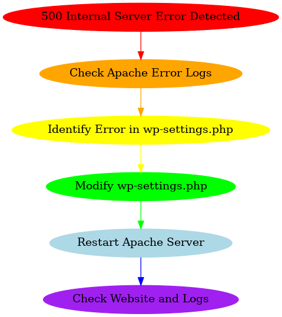

# The Case of the Missing Parenthesis: How a Tiny Typo Took Down the Site! 🕵️‍♂️

_"Ever thought one little typo couldn’t bring down a site? Think again!"_

## 🛠️ Issue Summary
- **Duration of the Outage**: August 15, 2024, 10:00 AM - 11:00 AM (UTC)
- **Impact**:
  - **Service Down**: The main website was completely inaccessible.
  - **User Experience**: 80% of users saw a 500 Internal Server Error—yikes!
- **Root Cause**: A missing parenthesis in the `wp-settings.php` file. Who knew syntax could be so unforgiving?

## 🕒 Timeline
- **10:05 AM**: 🚨 The issue was flagged by automated monitoring—time to panic!
- **10:10 AM**: 🧐 Initial investigation by the web development team—could it be a resource issue?
- **10:15 AM**: 🤔 The team ruled out resource issues—nope, that’s not it!
- **10:20 AM**: 💡 Discovery of the syntax error in the `wp-settings.php` file—bingo!
- **10:30 AM**: 📈 Escalation to the lead developer—time to call in the big guns.
- **10:45 AM**: 🛠️ Fix applied and Apache restarted—fingers crossed!
- **11:00 AM**: 🎉 Website back online—crisis averted!

## 🔍 Root Cause and Resolution
- **Root Cause**: A tiny typo—a missing parenthesis—caused the PHP parser to fail spectacularly, leading to that dreaded 500 error.
- **Resolution**: The typo was corrected, and the Apache server was restarted. Order was restored to the universe.

## 🛡️ Corrective and Preventative Measures
- **Improvements**:
  - More thorough code reviews—because sometimes, one more pair of eyes is all it takes.
  - Automated syntax checks in the CI/CD pipeline—because robots don’t miss parentheses.
  - Enhanced monitoring for 500 errors—so we can catch these faster next time.

- **Tasks**:
  - Patch the CI pipeline to include syntax checks—no more missing parentheses on our watch!
  - Implement a script to validate configuration files before deployment—let’s make sure we’re always ready.
  - Conduct a training session on best practices—because prevention is better than cure.

---

### Fun Fact: 
Did you know? The absence of a single parenthesis has been known to cause significant downtime across many tech platforms. Don't let your code be another statistic!

## 📊 Diagram of the Debugging Process

In the battle between code and syntax, the syntax won this round… but we’ll be ready next time! 💪
